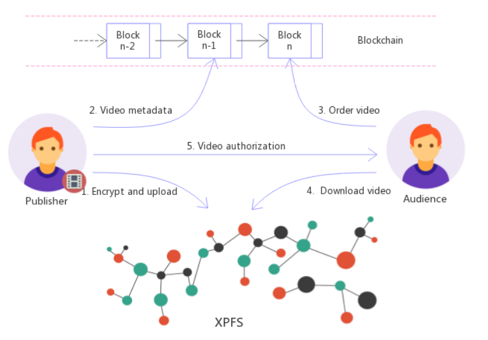
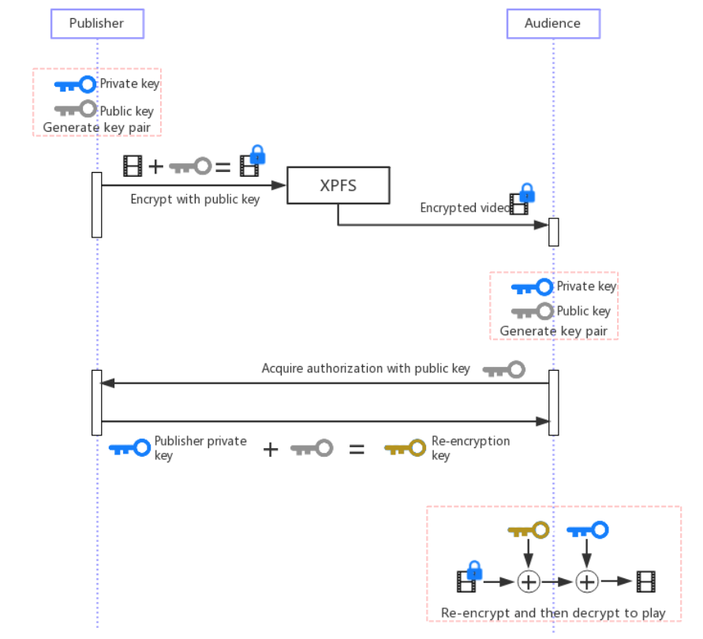

Xinchain

A Decentralized Data Trading System

Background
==========

With the development of the Internet, the transmission of data become more and
more convenient, but at the same time, because the traditional Internet is based
on a centralized architecture, all data need to be transferred through a
centralized platform, this centralized model also brings many problems.

One problem is the reliability of service. Because the data are stored on the
central server, once the central server fails or the service provider shuts down
the service, the data stored on these central servers will also be inaccessible.
Even with the emergence of distributed storage technology, it is still difficult
to solve this problem thoroughly. For example, some time ago, a cloud server
provider malfunctioned, resulting in the loss of all data placed on the cloud
server by customers, causing losses of nearly ten million dollars to customers.

Another is data security issue. Because the data are stored on the central
server, it is easy to cause data loss due to the service provider’s mistakes.
For example, if the copyrighted video content produced by individuals is
published on the online video website, they can gain profits. After being
published on the video website and in the process of playing by other users, the
film files are easy to be leaked without authorization, which will result in the
loss of the publisher's profits.

Transaction cost is also a problem. When trading through centralized platforms,
platforms often benefit by drawing a percentage, which is also determined by
platforms. Platforms can adjust the rules at any time, which is very unfair to
both sides of the actual transaction.

Xinchain
========

Xinchain is a decentralized data trading system, which aims to change the way of
data distribution and transaction in traditional central architecture by using
block chain technology. Xinchain is composed of three parts: decentralized
storage and distribution system, decentralized retrieval system and
decentralized economic system.

The user's personal data is published to the decentralized storage and
distribution system through encryption. The encryption key is only stored by the
user, and can be decrypted only after authorization, thus ensuring the security
of user data. Other users can't access data without authorization even if they
download it. Moreover, file data is distributed stored in multiple nodes of the
system, which effectively avoids the problem of data inaccessibility caused by
single point failure and ensures the reliability of data access.

Decentralized retrieval system is responsible for retrieving the data users
want. Users can retrieve interested files according to file name or other
attributes. Because it is decentralized, it also ensures the reliability of the
retrieval system, and will not be unable to retrieve because of one machine
failure. After the user retrieves the data he wants, he can decrypt the access
data by purchasing the data and authorizing the copyright party. The money that
the user purchases the data directly transfers to the copyright party's wallet.
Based on block chain technology, file information published by users and
transaction data will be recorded on the chain, which ensures the authenticity
of data and the reliability of transactions.

Xinchain Player
===============

Xinchain player is a decentralized film distribution system based on Xinchain.
There are only two roles in this system. One is clients, the one is producers.
Xinchain is based on Blockchain technology. When producers make a good movie,
they can publish this movie to the Xinchain system, then clients can distribute
and share this movie with other clients. When a client wants to watch a movie,
this client needs to spend money on the movie, and the movie producer can
receive money directly. Moreover, clients can earn money by sharing and
distributing movies. Blockchain smart contract will perfectly deal with all
transactions without any trust cost which is out the reach of traditional
central servers.

Economic Model
==============

Publishing a movie includes movie introduction, posters, trailers, movie and
etc. The purpose of trailers is distributing movies which can attract clients.
Watching trailers, sharing movies with friends can earn points. If a client
searches a new movie in Xinchain system, then a new page with posters and
introductions will pop up, and this client can watch movies if this client has
any interests. After watching a trailer, this client can earn points. If client
A wants to watch the whole movie, this client can spend points to watch the
entire movie. If A shares a movie with friends and friends watch this movie,
client A can earn some points.

Except watching movies and sharing videos with friends can earn points,
uploading bandwidth also can make points. When clients watch trailers and
movies, they can share their bandwidth if they want. Other clients can download
movies from them, and providers can earn points. If you can supply more
bandwidth, the more points you can earn.

Xinchain smart contract can deal with all purchasing and earning points between
video publishers and clients. Furthermore, Xinchain will not issue any token in
Xinchain and points will only flow in Xinchain system. When a client wants to
recharge points, Xinchain will generate points in this client account. Xinchain
will use sidechain technology to do value two-way anchor with a public
blockchain. Clients can use digital currency to recharge points in Xinchain,
then clients can use points to do any trading. After trading, clients also can
redeem their points to other digital currencies.

Price Mechanism
===============

Publishers can decide the movie price. A publisher should set spending points
for this movie when a publisher decides to publish a movie.

When publishers publish a movie, they should recharge points first in order to
do film promotion, then set reward points for watching trailers and sharing
movies with friends. When this reward point is out, clients can get zero reward
point by watching trailer. If publisher set reward points to zero, clients watch
a trailer earn a zero point. When clients search videos, the system will pop up
the video which provides high reward points to clients.

A client upload sharing bandwidth price will dynamically adjust by bandwidth
supply and demand market. If there is not enough bandwidth in the system, the
system will increase bandwidth price gradually which can attract clients to
share their bandwidth. When there is a lot of bandwidth in the system, the
system will decrease bandwidth price gradually. The reason for doing this is we
want to maximize client’s profits. If the system has enough nodes, the supply
and demand will go to a balanced state, in other words, the bandwidth price will
go to a stable state.

Copyright Protection
====================

We use an asymmetric encryption algorithm to encrypt the movie content. When a
publisher creates movies, then a public-private key pair was created. The
Xinchain system will encrypt contents by using this key. So, publishers can
distribute the file without any risks. And clients spent zero points on
downloading videos. If clients want to watch the whole video, clients should pay
for that. When clients pay for watching a video, a publisher will authorize
clients to decipher the video. A publisher uses proxy re-encryption tech to
authorize clients, and clients will use a public key to generate a re-encryption
private key. Doing this can secure the movie content and private key from
publishers.

Government Regulation
=====================

Xinchain system should protect movie copyright and create a pure, healthy and
green network for clients. Xinchain system will upload publisher information and
video information to the Blockchain which can be traced.

There are some basic rules in protecting movie content copyright and ensuring
legal videos. Publishers should pass the identity verification process.
Moreover, Xinchain system will record MAC address, IP address, hardware ID and
video hash in blockchain which can persist forever. Xinchain system also
requires publisher official information which can verify publisher IP address.
Only the publisher who passes the verify process can publish the movie in
Xinchain system.

If a publisher wants to provide video services, this publisher should make sure
online until not providing video services. If a publisher is offline, clients
cannot play videos. So, if someone publishes an illegal video, government
officers can trace this person by IP address. Publishers may want to delete
illegal files in his/her computers, but officers can charge this person by
records in the blockchain, because the information in blockchain can’t be
deleted and changed.

Xinchain system also will screen shoot the video content in a random time, then
packages images and original video, and uploads this package to the network. If
these images are illegal, the original video is illegal too. Xinchain will
adjust the shooting frequency. We will make sure the screen images are enough
for forensics and will not leak too much video content.

Xinchain system will provide a reporting entrance. Anybody can report illegal
and pirating videos. If we verify the reporting information, we will lock this
video to the blacklist. So, nobody can share and watch this video in the
network.

Technology Details
==================

Core business process
---------------------

Core business process image

Movie publishers can publish movies, set video price, trailer price, promotion
price and etc. Xinchain system will encrypt video and relative materials, then
upload these resources to the P2P network and blockchain system.

When clients buy a video, the smart contract will retrieve the video price and
transfer the points to publisher account from clients account. Xinchain system
will record the buying order in blockchain at the same time.

Clients can ask for authorization from the publisher, then clients can play this
video with a proxy-private key.

Video Storage and Video distribution
------------------------------------

Xinchain system based on IPFS which can store video and distribute video. IPFS
is a P2P distributed file system. It aims to replace HTTP and build a faster,
secure, free internet.

According to the Xinchain business model, we make a lot of improvement in IPFS.
XPFS will segment videos into small pieces, and each piece video file contains
some backup video files. So, in the upload bandwidth incentive mechanism, the
number of pieces of video will dynamically adjust by hot video or not. When
clients download videos, clients will download video from nearest and best
nodes. If more and more people watching a video, clients can find this video at
any node, so clients can get a better experience.

Video Encryption and Authorization
----------------------------------

We use Proxy re-encryption to encrypt video and authorize the client. Proxy
re-encryption will keep the publish private key safe.

Proxy re-encryption is a public key password, and there is a proxy agent in this
system. In this system, an agent can get re-encryption private key, then use
this private key to decode the file. Proxy re-encryption can make sure agent can
get nothing about plain text through this agent gets a private key.

There is a very important standard in Proxy re-encryption, called anti-collusion
attach. The anti-collusion attack is that agent and authorized people can’t get
the real private key when they come together.

Xinchain system is a decentralized system, so there are only two roles in this
system. One is clients, the other one is publishers. Xinchain uses proxy
re-encryption technology and combines the agent with the client side. Then use
client private key to decode encrypted video data. Anti-collusion makes sure
client and agent can’t get a private key though they are together.

Video encryption and authorization process

Smart contract
--------------

We will record all user data, publishing video history and purchasing history.
This system is based on EOS blockchain tech. And we build a smart contract to
maintain data.

The smart contact includes the following features:

### Create an Account

We will create a ringleaieos account in the blockchain system, then use this
account to invoke “create account” function in smart contract to create a
xinchain account. We will initial all settings to the default state. Xinchain
accounts are one-to-one correspond to the blockchain accounts. Ringleaieos
account will record account balance of points, usage of points, incomes, and
files information.

### Publish Videos

Video publisher can invoke “publish” function in the smart contract. The
Xinchain player will transfer a video hash address and a video price to the
smart contract. This smart contract will check the hash address first. If the
smart contract has this hash address, the smart contract will terminate this
process and return an error to Xinchain player. If this hash code is new to the
smart contract, this contract will relate video info with a video publisher.
This information will be upload to the blockchain.

### Buy Videos

Clients can invoke “buyvideo” function, then Xinchain player transfers a hash
address to the smart contract. The smart contract will check this client already
buy a movie or not. If someone already buys this movie, the smart contract will
reject this request and return an error to Xinchain player. If a client buys
this video in the first time, the smart contract will retrieve video info by
hash address, get publisher account info and video price. If a client has enough
balance, then smart contract transfers points from client account to publisher
account. If this client has not enough balance, the smart contract will
terminate this request.

### Recharge points

Xinchain will support multiple digital currencies. When a client recharges XIN
points, Xinchain client side will send this request to network gate. Then
Xinchain client side will broadcast this transaction to the target blockchain.
This network gate is managed by a famous exchange market and a miner company.
When the gate confirms this transaction, the gate will do the exchange rate
calculation, then the gate will send XIN points to a client’s address. This
network gate is a decentralization gate. XIN is a single anchor to USD.
Normally, 1 XIN equal 1 dollar.

### Redeem points

If a client wants to redeem points, this client just inputs the number of Xin
points and target blockchain address, then the Xinchain client side will deal
with all transaction. If a client clicks “redeem button”, Xinchain player will
broadcast this transaction to the target blockchain multiple sign address. When
the gate observes this transaction, it will transfer digital currency to the
correspondence account.

Future Planning
===============

Xinchain player allows every creative content producer to release their original
videos, make money directly through authorized playback, and let every content
producer have a platform for self-realization. Although xinchain player's goal
is to change the existing film distribution model, it is not mutually exclusive
for traditional video platforms. They have a lot of copyrighted film, including
purchased and self-made. They can gain profits by accessing xinchain, just like
individual producers, and form a good complement with their own advantages,
which together constitute the xinchain video distribution ecosystem.

From Xinchain's model, we can see that the core elements are the decentralized
storage and distribution system, the decentralized retrieval system and the
decentralized economic system. Xinchain player is only one of the applications
based on Xinchain. Besides the video files, other data is also feasible, such
as, in the field of health care, everyone's genetic data and health data and so
on. The ownership of these data belongs to individuals, not to any medical or
detection institutions. If other institutions need to use them, they must be
authorized and paid to individuals. Xinchain can solve this problem well by
replacing the video player with a gene and health data parser. So in the future,
xinchain plans to support more different types of data and build a universal
personal ownership data trading system.
